# System Architecture Diagram & Description

This document details the system design, machine learning components, data pipeline, and MLOps architecture of the **Adversarial Transaction Disguise Detector**.

## 1. Core Architecture Overview

The system uses a **Generative Adversarial Network (GAN)** training loop combined with a **Graph Neural Network (GNN)** to detect fraud. 
* **Generator (Attacker):** An LSTM model that generates sequences of synthetic transactions designed to bypass the GNN.
* **Discriminator (Defender):** A 3-hop GraphSAGE model that identifies fraud based on transaction network structure and nodes features.

```mermaid
graph TD
    subgraph Adversarial Training Loop
        Gen[LSTM Generator / Attacker] -->|Generates synthetic transaction sequence| Sync[Synthetic Transactions]
        Sync -->|Perturbs graph topology| GraphBuilder[Graph Builder]
        GraphBuilder -->|Constructs transaction-card bipartite graph| GNN[GraphSAGE GNN / Defender]
        GNN -->|Evaluates transactions| Loss[Adversarial Minimax Loss]
        Loss -->|Gradients backpropagate| Gen
        Loss -->|Gradients backpropagate| GNN
    end

    subgraph Inference & Deployment Serving Stack
        Client[API Client] -->|POST /api/v1/predict| FastAPI[FastAPI Gateway]
        FastAPI -->|Extracts subgraph features| Model[ONNX Runtime Session]
        Model -->|Raw logits| Calibrator[Platt Calibrator]
        Calibrator -->|Well-calibrated probabilities| Out[Response Score / Decision]
        
        FastAPI -->|Real-time features| SHAP[SHAP Explainer]
        SHAP -->|Explainability map| Out
        
        FastAPI -->|Log transaction metrics| Prometheus[Prometheus Collector]
        Prometheus -->|Time-series metrics| Grafana[Grafana Dashboard]
        FastAPI -->|Compare feature stats| Drift[PSI Drift Detector]
        Drift -->|Alert on distribution drift| Slack[Slack / PagerDuty Alert]
    end
```

---

## 2. Key Components Details

### A. Graph Builder
1. **Nodes:** Bipartite graph representing transactions and cards (`card1` - `card6`).
2. **Edges:** Temporal connections based on consecutive usage or sharing of cards.
3. **Features:** Vesta features, amount, card metadata, and historical aggregation variables.

### B. GraphSAGE GNN Discriminator
* **Layers:** 3-hop message passing with residual skip connections.
* **Regularization:** **DropEdge (p=0.3)** to prevent edge memory overfitting, and **LayerNorm** to enable single-transaction inference without batch dependence.

### C. LSTM Generator
* Generates synthetic sequences mimicking high-density transaction sequences.
* Uses **Mean Pooling** over the full generated sequence so the attacker's full temporal signal is captured.

### D. Platt Calibration
* Minimizes the Brier score on out-of-sample data, adhering to a hard constraint of `Recall >= 75%`.
* Transforms GNN logits into real-world probabilities, avoiding standard calibration drops in recall.

### E. SHAP Explainability
* Intercepts predictions to compute SHAP values for features, explaining exactly why a transaction was flagged as suspicious.
